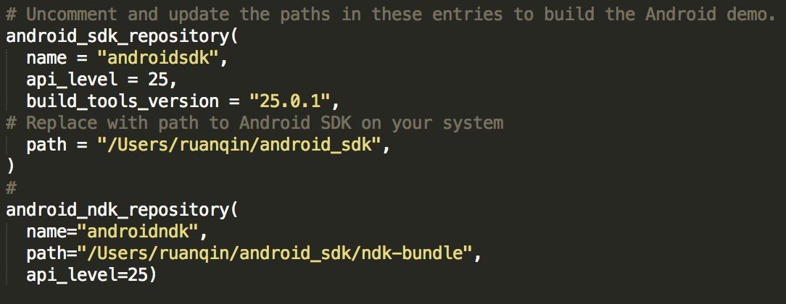

##在安卓上构建,运行Tensorflow android demo

### 移植过程
* clone the TensorFlow
   
  ```
   git clone --recurse-submodules https://github.com/tensorflow/tensorflow.git
  ```
 
* install Bazel, NDK, SDK

* Edit WORKSPACE

  打开WORKSPACE文件,修改NDK和SDK，如下图：
  
  

* Build
  ```
   bazel build -c opt //tensorflow/examples/android:tensorflow_demo
  ```
   
* Install   
  
  ```
   adb install -r bazel-bin/tensorflow/examples/android/tensorflow_demo.apk
  ```

### tensorflow_demo包括

* TF Classify: 使用[Google Inception](https://arxiv.org/abs/1409.4842)模型,实时对相机获取的图像分类，在相机图层的顶层展示图像检测结果
  
* TF Detect: 基于[Scalable Object Detection using Deep Neural Networks](https://arxiv.org/abs/1312.2249)构建的模型，实时追踪相机图层中的人

### 再移植

上述的过程以及获得的tensorflow_demo是需要基于bazel构建的，这对于习惯使用gradle的我们，还是不太友好，经过找寻，在github上看到了[Kosuke Miyoshi](https://github.com/miyosuda)的两个项目[TensorFlowAndroidDemo](https://github.com/miyosuda/TensorFlowAndroidDemo), [TensorFlowAndroidMNIST](https://github.com/miyosuda/TensorFlowAndroidMNIST). 都是对原项目进行了抽取，变成了纯粹的基于gradle构建的android项目。

#### 再移植过程
1.抽取过程大致是这样：

* 使用bazel构建原tensorflow android demo
* 创建jni文件,将从tensorflow中抽取的相关文件放入，注意bazel-out目录下的.lo and .a文件全部需要

2.运行深度学习脚本，得到训练好的模型文件，放入assets中

  ```
  python beginner.py
  ```

3.编译jni，得到so文件，放入相应armeabi包中

4.run ~ .~