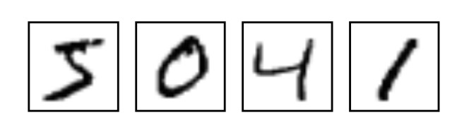
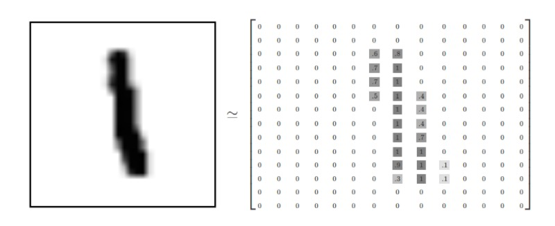
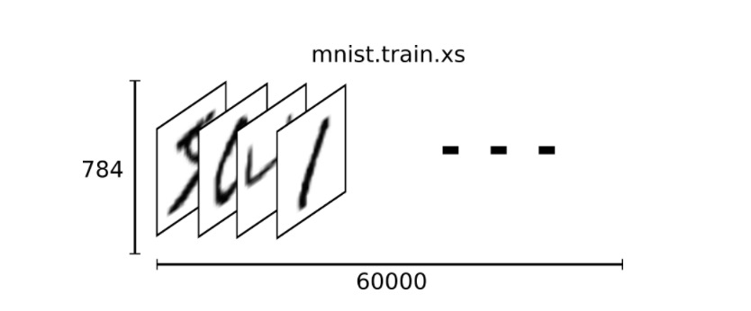
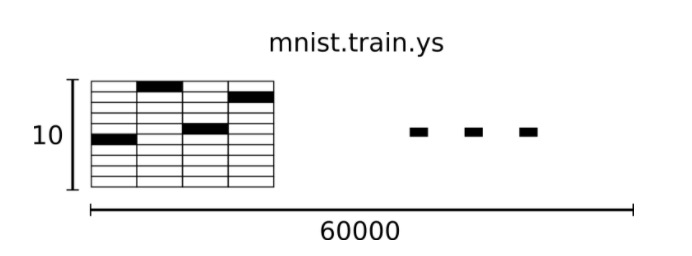

#Hello World (深度学习版)
记一次浪潮之巅的探索过程

##几个概念

**[机器学习](https://en.wikipedia.org/wiki/Machine_learning)**: 机器学习想做的事情，简单的说是要从资料中归纳出有用的规则。(从数据推演结论)

**[深度学习](https://en.wikipedia.org/wiki/Deep_learning)**：机器学习分支。利用大量数据。教会机器做人类能做的事情。

**一些可用深度学习的栗子**: 图像识别；语音视频；自然语言处理NLP; 

**[Tensorflow](https://www.tensorflow.org/)**: 简单理解，就是一个深度学习的框架，提供了很多好用的工具


##深度学习过程

0. 开发工具准备
1. 得到数据集 ；
2. 数据集预处理 ； 
3. 定义模型 ；  
4. (使用训练集训练模型  使用测试集衡量模型精确度 ) —loop的状态 n次  ；
5. 保存&&评估模型 ；
6. 投入实际中使用 ；

##hello world - 开发工具准备

* install python
* [install tensorflow](tensorflow环境安装.html) 
* bazel
* sdk , ndk,

##Hello world - 得到数据集

就如编程有hello world, 深度学习有MNIST :-D

MNIST来自[Yann LeCun 的网站](http://yann.lecun.com/exdb/mnist/),是一个入门级的计算机视觉数据集。它包含各种手写数字图片;也包含每一张图片对应的标签，告诉我们这个是数字几。所以，我们可以知道，一个最小完整数据包括(数字图片&图片对应标签)。



```
import tensorflow.examples.tutorials.mnist.input_data
mnist = input_data.read_data_sets("MNIST_data/", one_hot=True)
```

##hello world - 数据集预处理

* 处理1：
 1. 下载下来的数据集被分成两部分：60000行的训练数据集（mnist.train）和10000行的测试数据集（mnist.test)；
 2. 最小单位数据包括 images和labels。🌰：训练数据集的图片是 mnist.train.images ，训练数据集的标签是 mnist.train.labels
    
* 处理2：每一张图片包含28X28个像素点。我们可以用一个28X28的数组来表示。如下图。**铺平每一个数组，转换为28X28=784维度的向量，其中的每一个向量值在0-1间，代表对应像素点的强度**



* 数据集想象：结合处理1，2。我们能推出数据集images部分的样子。
  
  🌰：mnist.train.images形状是[60000,784],如下图：
  
   

* 处理3：标签是介于0到9的数字，用来描述给定图片里表示的数字。我们用除了某一位的数字是1外其余各维度数字都是0的向量表示。比如0，就是([1,0,0,0,0,0,0,0,0,0,0])

* 数据集想象：结合处理3。我们能推出数据集labels部分的样子。
  
  🌰：mnist.train.labels形状是[60000,10],如下图：
  
   
   
   
##Hello world - 定义模型

###Softmax

###构建Softmax 回归模型
 
  * 占位符
  
  我们通过为输入图像和目标输出类别创建节点，来开始构建计算图。
  
  ```
  x = tf.placeholder("float", shape=[None, 784])
  y_ = tf.placeholder("float", shape=[None, 10])
  ```
  
  这里的x和y并不是特定的值，相反，他们都只是一个占位符，可以在TensorFlow运行某一计算时根据该占位符输入具体的值。

  输入图片x是一个2维的浮点数张量。这里，分配给它的shape为[None, 784]，其中784是一张展平的MNIST图片的维度。None表示其值大小不定，在这里作为第一个维度值，用以指代batch的大小，意即x的数量不定。输出类别值y_也是一个2维张量，其中每一行为一个10维的one-hot向量,用于代表对应某一MNIST图片的类别。

  虽然placeholder的shape参数是可选的，但有了它，TensorFlow能够自动捕捉因数据维度不一致导致的错误。

  * 变量
  
   我们现在为模型定义权重W和偏置b。可以将它们当作额外的输入量，但是TensorFlow有一个更好的处理方式：变量。一个变量代表着TensorFlow计算图中的一个值，能够在计算过程中使用，甚至进行修改。在机器学习的应用过程中，模型参数一般用Variable来表示。
  
  ```
  W = tf.Variable(tf.zeros([784,10]))
  b = tf.Variable(tf.zeros([10]))
  ```
   
   我们在调用tf.Variable的时候传入初始值。在这个例子里，我们把W和b都初始化为零向量。W是一个784x10的矩阵（因为我们有784个特征和10个输出值）。b是一个10维的向量（因为我们有10个分类）。
   
   变量需要通过seesion初始化后，才能在session中使用。这一初始化步骤为，为初始值指定具体值（本例当中是全为零），并将其分配给每个变量,可以一次性为所有变量完成此操作。
  
   
  ```
  sess.run(tf.initialize_all_variables())
  ```
  
  * 构建 ! 只需要一行
    
    实现我们的回归模型。我们把向量化后的图片x和权重矩阵W相乘，加上偏置b，然后计算每个分类的softmax概率值
  
  ```
  y = tf.nn.softmax(tf.matmul(x,W) + b)
  ```  
    
##Hello world - 训练模型

* 在训练模型前，我们需要添加一个操作来初始化我们创建的变量：

 ```
 init = tf.initialize_all_variables()
 ```
* 现在我们可以在一个Session里面启动我们的模型，并且初始化变量：

 ```
 sess = tf.Session()
 sess.run(init)
 ```
* 然后开始训练模型，这里我们让模型循环训练1000次！
 
 ```
 for i in range(1000):
  batch_xs, batch_ys = mnist.train.next_batch(100)
  sess.run(train_step, feed_dict={x: batch_xs, y_: batch_ys})
 ```
 该循环的每个步骤中，我们都会随机抓取训练数据中的100个批处理数据点，然后我们用这些数据点作为参数替换之前的占位符来运行train_step。
 
##hello world - 评估&保存模型

* 评估模型 
 
 ```
 correct_prediction = tf.equal(tf.argmax(y,1), tf.argmax(y_,1))
 accuracy = tf.reduce_mean(tf.cast(correct_prediction, "float"))
 print sess.run(accuracy, feed_dict={x: mnist.test.images, y_: mnist.test.labels})
 ```
* 保存模型
 
 ```
 # Create some variables.
 v1 = tf.Variable(..., name="v1")
 v2 = tf.Variable(..., name="v2")
 ..
 # Add an op to initialize the variables.
 init_op = tf.global_variables_initializer()
 
 # Add ops to save and restore all the variables.
 saver = tf.train.Saver()
 
 # Later, launch the model, initialize the variables,   do some work, save the
 # variables to disk.
  with tf.Session() as sess:
   sess.run(init_op)
 # Do some work with the model.
   ..
  # Save the variables to disk.
  save_path = saver.save(sess, "/tmp/model.ckpt")
  print("Model saved in file: %s" % save_path)
 ```


run ~ ~ 
##hello world - 投入实际中使用

* 移植tensorflow到android平台(通过bazel构建)，详细指导参见
  [github-tensorflow-android](https://github.com/tensorflow/tensorflow/tree/master/tensorflow/examples/android)
  
  [个人移植过程整理](tensorflow移植到Android上.html)  

##参考&学习推荐 

* [Tensorlflow官网-MNIST For ML Beginners](https://www.tensorflow.org/tutorials/mnist/beginners/)
* [Tensorlflow官网-Deep MNIST for Experts](https://www.tensorflow.org/tutorials/mnist/pros/)
* [Tensorlflow官网](https://www.tensorflow.org/)
* [Tensorflow官方文档中文版](http://wiki.jikexueyuan.com/project/tensorflow-zh/)
* [Tensorflow github](https://github.com/tensorflow/tensorflow)
* [Udacity深度学习教程-使用tensorflow演示](http://cn.udacity.com/)
* [Udacity机器学习教程](http://cn.udacity.com/)
* [TF Girls 修炼指南-出自B站,2333333~~~](http://www.bilibili.com/video/av6642102/)
* [TF Girls 修炼指南by哲的王-github](https://github.com/CreatCodeBuild/TensorFlow-Chinese-Tutorial)
* [一篇能解惑机器学习/深度学习/AI的好文](http://www.cnblogs.com/subconscious/p/4107357.html)
* [跟我上手深度学习: 五分钟尝试第一个深度学习(Caffe)训练和图像分类(详细图文步骤)](https://my.oschina.net/u/1431433/blog/687393)
* [ML more](https://www.zhihu.com/question/20691338)
* [DL more](https://www.zhihu.com/question/26006703)
